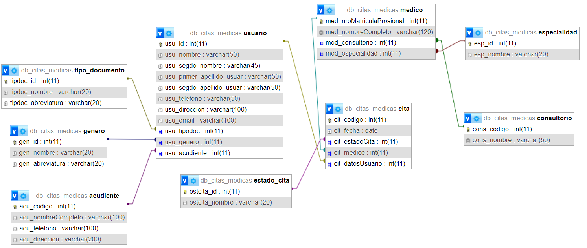

# Diagrama MER

# Consultas SQL

1. Obtener todos los pacientes alfabéticamente
   
2. Obtener todas las citas alfabéticamente
   
3. Obtener todos los médicos de una especialidad específica (por ejemplo, **'Cardiología'**):
   
4. Encontrar la próxima cita para un paciente específico (por ejemplo, el paciente con **usu_id 1**):
   
5. Encontrar todos los pacientes que tienen citas con un médico específico (por ejemplo, el médico con **med_nroMatriculaProsional 1**)
   
6. Obtener las consultorías para un paciente específico (por ejemplo, paciente **con usu_id 1**)
   
7. Encontrar todas las citas para un día específico (por ejemplo, **'2023-07-12'**)
   
8. Obtener los médicos y sus consultorios
   
9. Contar el número de citas que un médico tiene en un día específico (por ejemplo, el médico con **med_nroMatriculaProsional 1 en '2023-07-12'**)
   
10. Obtener los consultorio donde se aplicó las citas de un paciente
    
11. Obtener todas las citas realizadas por los pacientes de un genero si su estado de la cita fue atendidad
    
12. Insertar un paciente a la tabla usuario pero si es menor de edad solicitar primero que ingrese el acudiente y validar si ya estaba registrado el acudiente.
    
13. Mostrar todas las citas que fueron rechazadas y en un mes específico, mostrar la fecha de la cita, el nombre del usuario y el médico.

### Instalaciones dependencias

Packed.json

`npm init -y`

Instalación Nodemon

`npm i -E -D nodemon`

Instalar Express

`npm i -E express`

Instalar dotenv

`npm i -E -D dotenv`

Instalar mysql2

`npm i -E -D mysql2`

Instalar clase transformer

`npm i -E -D class-transformer`

Instalar reflect metadata

`npm i -E -D reflect-metadata`

Instalar typescript

`npm i -E -D typescript`

Instalación completa y rapida
`npm install -E -D nodemon express dotenv mysql2 class-transformer reflect-metadata typescript`

## Configuracion del tsconfig

      {
        "compilerOptions": { 
          "target": "es6",
          "module": "ES6",
          "moduleResolution": "node",
          "outDir": "./controller",
          "esModuleInterop": true,
          "experimentalDecorators": true,
          "emitDecoratorMetadata": true
        }
      }

##### Correción tablas

En las tablas de la imagen que nos fue entregada, especificamente en la tabla usuario tube que cmabiarle el nombre a la columna usu_e-mail a usu_email por el motivo de que era una manera de solucionar un error que me aparecia por la linea

Tube que hacer una correccion al nombre de la columna med_nroMaticulaProsional a med_nroMatriculaProfesional por el motivo de que me equivoqué nombrando esa columna con un nombre erroneo, asi que implemente la siguiente linea de codigo para corregirlo

`ALTER TABLE medico CHANGE med_nroMaticulaProsional med_nroMatriculaProsional INT NOT NULL  ;`

## EndPoints

Estos son los siguientes endpoints los cuales tienen las consultas pedidas

1. Obtener todos los pacientes alfabeticamente: http://localhost:5023/usuario
2. Obtener todas las citas alfabéticamente: http://localhost:5023/cita
3. Obtener todos los médicos de una especialidad específica: http://localhost:5023/medico/Dermatologia
4. Encontrar la próxima cita para un paciente específico: http://localhost:5023/pacientes/109539582/cita/proxima.
5. Encontrar todos los pacientes que tienen citas con un médico específico: http://localhost:5023/citaMedico/1/pacientes
6. Obtener las consultorías para un paciente específico: http://localhost:5023/consultorias/1/pacientes
7. Encontrar todas las citas para un día específico: http://localhost:5023/buscar/citas/2023-07-14
8. Obtener los médicos y sus consultorios: http://localhost:5023/obtener/medconsultorio
9. Contar  número de citas que un médico tiene en un día específico: http://localhost:5023/contar/citas/465899584/2023-07-12
10. Obtener los consultorio donde se aplicó las citas de un paciente:http://localhost:5023/aplicar/pacientes/1/consultorios
11. Obtener todas las citas realizadas por los pacientes de un genero si su estado de la cita fue atendidad:http://localhost:5023/genero/citas/1/Aprobada
12. Insertar un paciente a la tabla usuario pero si es menor de edad solicitar primero que ingrese el acudiente y validar si ya estaba registrado el acudiente: 
13. Mostrar todas las citas que fueron rechazadas y en un mes específico, mostrar la fecha de la cita, el nombre del usuario y el médico: http://localhost:5023/rechazadas/citas/rechazadas/7

